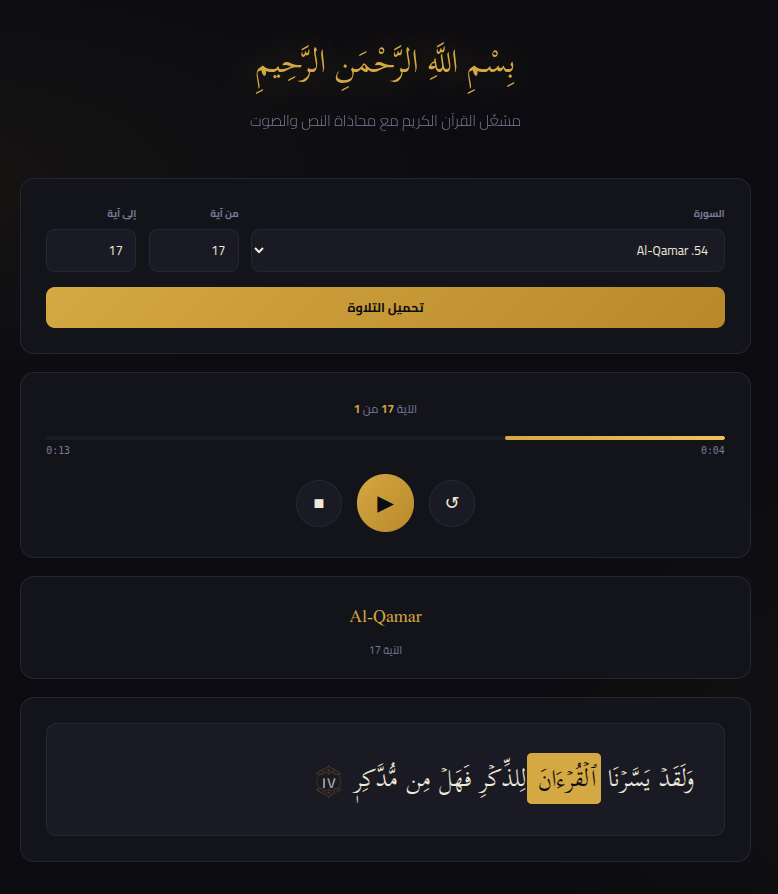

# 🕌 Quran Word-Level Timestamps

A complete pipeline for generating **word-level audio timestamps** for the Holy Quran, recited by **Sheikh Mahmoud Khalil Al-Husary**, with a web player that highlights each word in sync with the audio.

Link: <https://incredible-lollipop-7e69a1.netlify.app/>

---

<div style="text-align: center;">
  
</div>


## 📌 Project Overview

This project takes Quranic audio (aya-level MP3s) and produces a structured JSON file where every word has an exact `start` and `end` timestamp. The final output powers a web player that highlights each word as it is recited.

```
Audio (MP3) + Text (TXT)
        ↓
  WhisperX Forced Alignment
        ↓
  quran_timestamps.json
  { surah → aya → word → [start, end] }
        ↓
  Web Player (HTML/CSS/JS)
  Word-by-word highlighting
```

---

## 🗂️ Repository Structure

```
├── downloader.py          # Step 1 — Download audio + text from alquran.cloud API
├── fix_basmala.py         # Step 2 — Remove Basmala from first aya text files
├── align_all_mushaf.py    # Step 3 — Run WhisperX forced alignment → quran_timestamps.json
├── check_empty.py         # Step 4 — Verify no empty ayas in the output JSON
├── update_ar_text.py      # Step 5 — Replace aya text with clearer tashkeel from database.json
├── test_api.py            # Utility — Verify alquran.cloud API returns all 6,236 ayas
├── database.json          # Quran text with full tashkeel (sourced separately)
├── sheikhs.json           # Contains all info about all sheikh for downloading data from api
└── data/
    └── quran_timestamps.json   # Final output — used by the web player
```

---

## ⚙️ Pipeline — Step by Step

### Step 1 — Download Data
**File:** `downloader.py`

Downloads all 6,236 aya audio files (MP3) and their text from the [alquran.cloud](https://alquran.cloud) API.

- Audio edition: `ar.husary`
- Text edition: `quran-simple`
- Uses 10 parallel threads for faster download
- Saves to `Quran_Database/{surah_folder}/{aya_num}.mp3` and `.txt`

```bash
python downloader.py
```

Output structure:
```
Quran_Database/
  001_Al-Faatiha/
    001.mp3
    001.txt
    002.mp3
    002.txt
    ...
  002_Al-Baqara/
    ...
```

---

### Utility — Verify API Data
**File:** `test_api.py`

Quick sanity check that the API returned all 6,236 ayas for both text and audio before running alignment.

```bash
python test_api.py
```

---

### Step 2 — Fix Basmala
**File:** `fix_basmala.py`

**Problem:** The alquran.cloud CDN includes "بِسْمِ اللَّهِ الرَّحْمَنِ الرَّحِيمِ" prepended to the text of the first aya in every surah — but the audio files do **not** contain the Basmala. This mismatch breaks forced alignment.

**Solution:** Strip the first 4 words (Basmala) from `001.txt` in every surah except:
- Surah 1 (Al-Fatiha) — Basmala is part of the surah
- Surah 9 (At-Tawba) — has no Basmala

```bash
python fix_basmala.py
```

---

### Step 3 — Forced Alignment
**File:** `align_all_mushaf.py`

Runs **WhisperX forced alignment** on every aya to produce word-level timestamps.

**Model used:** `wav2vec2` Arabic alignment model via WhisperX  
**Hardware:** NVIDIA L4 GPU on [Lightning.ai](https://lightning.ai) Studio

Each aya is processed as:
```python
segments = [{"text": aya_text, "start": 0.0, "end": duration}]
result = whisperx.align(segments, model_a, metadata, audio, device)
```

Output for each word:
```json
{
  "word": "بِسْمِ",
  "start": 0.000,
  "end": 1.316,
  "score": 0.575
}
```

**Checkpoint support:** Saves after every surah — safe to resume if interrupted.

```bash
python align_all_mushaf.py
```

---

### Step 4 — Verify Output
**File:** `check_empty.py`

Scans the output JSON for any ayas with an empty `words` array, which would indicate a failed alignment.

```bash
python check_empty.py
```

---

### Step 5 — Update Aya Text
**File:** `update_ar_text.py`

**Problem:** The text from alquran.cloud (`quran-simple`) lacks clear tashkeel (diacritics), proper waqf markers, and uses inconsistent Unicode representations. This makes the text hard to read in the web player.

**Solution:** Replace the `text` field in `quran_timestamps.json` with cleaner Arabic text from `database.json`, which was sourced separately with full and consistent tashkeel.

Additionally filters out any malformed words from the `words` array:
- Words shorter than 2 characters (after removing diacritics)
- Words containing no Arabic characters

```bash
python update_ar_text.py
```

---

## 🚧 Challenges & Solutions

### 1. Data Size & Processing Power

**Problem:** The full Quran dataset is ~2.5GB of audio (6,236 MP3 files). Running WhisperX alignment locally would take days.

**Solution:** Used a free [Lightning.ai](https://lightning.ai) Studio with an **NVIDIA L4 GPU**. Downloaded the data directly inside the studio, ran alignment there, and exported the resulting JSON.

---

### 2. Basmala Mismatch

**Problem:** Every surah's first aya text file from the CDN contained the Basmala prepended to the actual aya text — but the audio file only contained the aya itself, not the Basmala. Feeding mismatched text and audio to WhisperX caused completely wrong timestamps for the entire first aya.

**Solution:** `fix_basmala.py` strips the first 4 words from the text of aya 1 in every surah (except Al-Fatiha and At-Tawba) before running alignment. The Basmala is then displayed separately in the web player as a decorative header, without any audio alignment.

---

### 3. Reciter Repeating Words (Waqf & Ibtida)

**Problem:** Sheikh Al-Husary sometimes stops mid-aya and restarts from a few words back (a practice called *waqf and ibtida* — pausing and resuming). This means the audio contains repeated words that don't exist in the reference text. Feeding the reference text directly to WhisperX forced alignment caused timestamp shifting for all subsequent words.

**Solution:** Switched to a two-step approach using **DTW (Dynamic Time Warping)** sequence alignment:

1. Transcribe the audio without any reference text — WhisperX hears and writes exactly what was said, including repetitions
2. Run forced alignment on the transcription to get accurate timestamps
3. Use a **Needleman-Wunsch** sequence alignment algorithm to match the transcribed words (with repetitions) back to the clean reference text — the algorithm correctly identifies and skips the repeated segments

This ensures timestamps reflect the **first occurrence** of each word, so the web player highlights the word at the right moment and skips the repeated portion without showing incorrect highlighting.

---

### 4. Poor Text Tashkeel from CDN

**Problem:** The text from alquran.cloud (`quran-simple`) had inconsistent or missing diacritics, which made the Quranic text hard to read in the web player. The tashkeel also differed from the standard Uthmani script used in printed Mushafs.

**Solution:** Sourced a separate `database.json` with full, clearly-written tashkeel. `update_ar_text.py` replaces only the `text` field in `quran_timestamps.json` while keeping all word timestamps intact. Word matching in the web player uses `stripDiacritics()` to handle any remaining differences between the display text and the timestamp words.

---

## 🌐 Web Player

The web player (`index.html` + `main.js`) loads data from `data/quran_timestamps.json` and audio from the alquran.cloud CDN.

**Features:**
- Select any surah and aya range
- Play / Pause / Stop / Restart controls
- Word-by-word highlighting synchronized to audio
- Basmala displayed as a styled header (no alignment) for non-Fatiha surahs
- Aya separator marker `۝` with Arabic numerals
- Arabic surah names with aya range display

**To run locally:**
```bash
# Serve with any static file server
python -m http.server 8000
# Open http://localhost:8000
```

---

## 📊 Dataset Stats

| | |
|--|--|
| Reciter | Sheikh Mahmoud Khalil Al-Husary |
| Surahs | 114 |
| Ayas | 6,236 |
| Words aligned | ~77,000 |
| Audio format | MP3, 128kbps |
| Alignment model | WhisperX + wav2vec2 Arabic |

---

## 🛠️ Requirements

```bash
pip install whisperx torch torchaudio librosa requests tqdm
```

GPU recommended for alignment (NVIDIA L4 or equivalent).

---

## 📄 JSON Structure

```json
{
  "001": {
    "surah_number": 1,
    "surah_name": "Al-Faatiha",
    "ayat": {
      "001": {
        "aya_number": 1,
        "text": "بِسۡمِ ٱللَّهِ ٱلرَّحۡمَٰنِ ٱلرَّحِيمِ",
        "words": [
          { "word": "بِسْمِ",      "start": 0.000, "end": 1.316, "score": 0.575 },
          { "word": "اللَّهِ",     "start": 1.336, "end": 1.480, "score": 0.292 },
          { "word": "الرَّحْمَنِ", "start": 1.501, "end": 1.809, "score": 0.078 },
          { "word": "الرَّحِيمِ",  "start": 1.830, "end": 5.283, "score": 0.519 }
        ]
      }
    }
  }
}
```

---

## 🙏 Acknowledgements

- Audio: [alquran.cloud](https://alquran.cloud) API
- Alignment: [WhisperX](https://github.com/m-bain/whisperX)
- Compute: [Lightning.ai](https://lightning.ai) Studios
